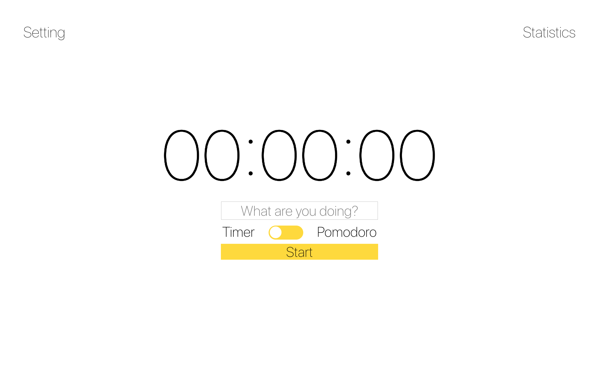
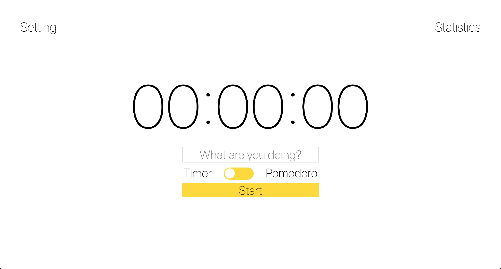
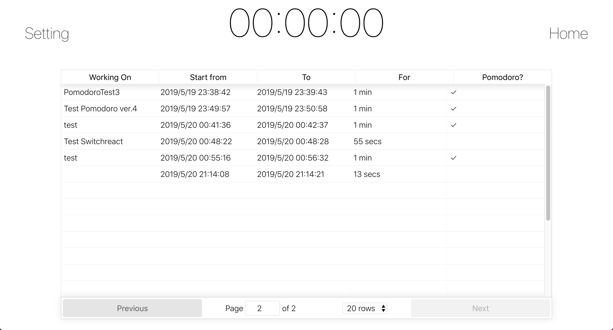
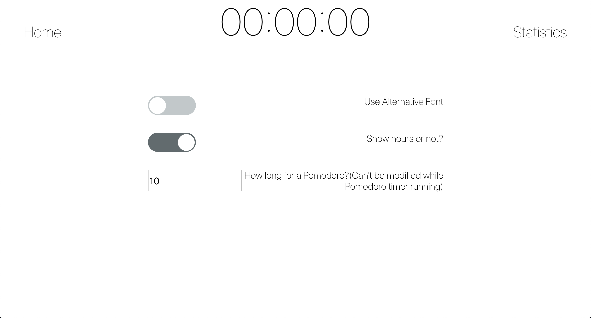

# A basic Timer/Pomodoro
NTU Web Programming 2019 Midterm Project

## Finish Requirements

* Client-side programs in React.js
* Server-side programs in Node.js

## Finish Recommended

* Database to store persistent data
  * I use MongoDB via mongoose, database provided by mlab's free service
* Use “Promise” or “Async/Await” to ensure asynchronous non-blocking communications
  * Being used when implement RESTful api
* Handwritten scss
  * Despite some package(ex: `react-switch`, `react-table`) comes with their default css.

## Demo Video

[https://youtu.be/qxZb1ENcWmU][1]

## How to start?

`npm start` in `backend` and `frontend`, `backend` will be `localhost:5000`, frontend is `localhost:3000`.

( Before you use, Please Enter database address in `backend/models/entry` )

## Frontend

Three Main pages, route from `Timer.js`

* Put most of algorithm and data in `Timer.js`, so all children below can share the data(e.g. current Timer/Pomodoro Time)

### Home

Main page of program, user can enter what are they doing and choose between two mode — Timer / Pomodoro

Once user click start, the Timer will grow and start to record.

### Statistic

Statistic of all the records this program record, `Pomodoro` will only be true when a user complete a Pomodoro. If a pomodoro interrupted by user, `Pomodoro` won't be true.

### Setting

* Use Alternative Font
  * This option will use another font to give user a musch more formal feeling.
* Show hours or not?
* How long for a Pomodoro?

### Using modules

* Third party: `react-switch`, `react-table`, scss support
* React: `React`, `ReactDOM`

## Backend

Before you use, Please Enter database address in `backend/models/entry` ( `const uri =` )

All method connect to database have been defined in `communication.js`, and model for mongoose defined in `entry.js`, routing part is mainly in `user.js`.

### Using package

`express`, `mongoose`, `cors`, `body-parser`, `cross-env` to define PORT.

[1]: https://youtu.be/qxZb1ENcWmU